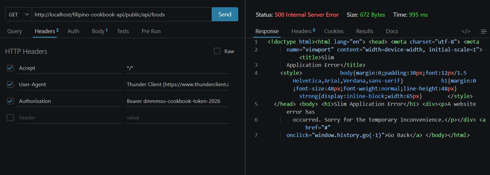
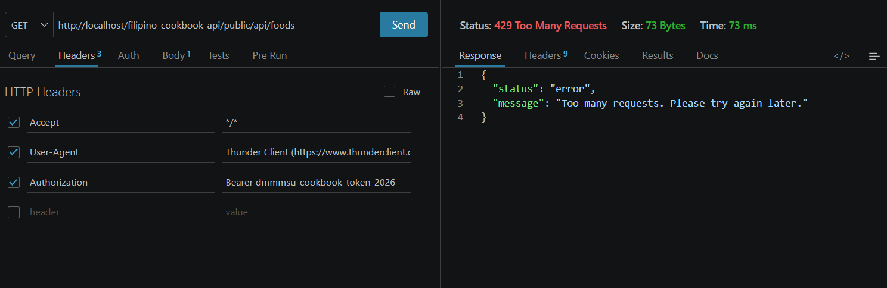
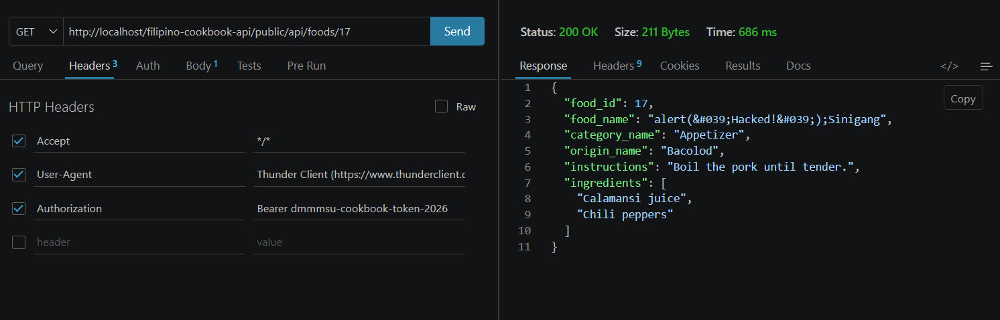
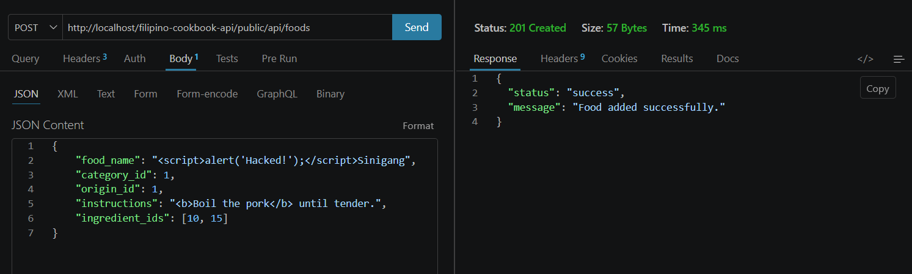
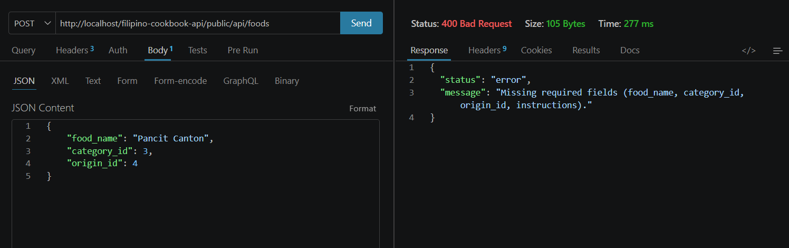
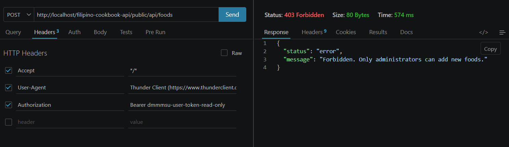

# Secured Filipino Cookbook API

A RESTful API built with the Slim Framework for retrieving and managing Filipino food recipes, categories, and ingredients.

## Repository Contents
- Complete Slim Framework API source code.
- Exported SQL database file (`database/filipino_foods_relational.sql`).
- Thunder Client testing screenshots.

## API Description
The Filipino Cookbook API is a secured REST API that provides structured information about traditional Filipino dishes, including their categories, regional origins, ingredients, and cooking instructions.

- **Purpose:** To give developers a simple, structured way to retrieve data about Filipino foods and to provide a secure, production-ready application protected against unauthorized manipulation.
- **Type of information provided:** Food names, categories, regional origins, cooking instructions, and ingredient lists.
- **Intended users:** Students and developers building client applications that need Filipino food data.
- **Main functions:** Retrieve all foods, retrieve a single food, search foods by name, retrieve categories, retrieve ingredients, and add new foods.

## Features
- Retrieve all Filipino foods
- Retrieve food categories
- Retrieve food origins (embedded within food records)
- Retrieve ingredients
- View the details of a specific food by ID
- Search for foods by name
- Add a new food entry (Admin role required)
- Authenticate requests using Bearer tokens (Admin and User roles)
- Rate limit requests to prevent API spam and brute-force attacks
- Input validation and XSS sanitization
- Return information in structured JSON format

## Technologies Used
- PHP
- Slim Framework 4
- MySQL
- Composer
- JSON
- XAMPP (Apache + MySQL)
- Thunder Client (for testing)
- Git
- GitHub

## Prerequisites
- XAMPP (or any local PHP/MySQL server).
- Composer installed globally.

## Installation Instructions

1. Clone the repository:

```
git clone https://github.com/vhinsonj/filipino-cookbook-api-fontanos.git
```

2. Navigate into the project folder:

```
cd filipino-cookbook-api-fontanos
```

3. Install dependencies:

```
composer install
```

4. Import the database (see **Database Setup** below).
5. Start Apache and MySQL in XAMPP.
6. Configure credentials in `public/index.php`.
7. Test the endpoints using Thunder Client or Postman.

## Database Setup
- **Database name:** `filipino_cookbook_api`
- **SQL file:** `database/filipino_cookbook_api.sql`

**Import instructions:**
1. Open phpMyAdmin (`http://localhost/phpmyadmin`)
2. Create a new database named `filipino_cookbook_api`
3. Click **Import**
4. Select `database/filipino_foods_relational.sql`
5. Click **Go**

**Tables & Relationships:**
```
categories -> foods <- origins
foods -> food_ingredients <- ingredients
```

## Base URL
```
http://localhost/filipino-cookbook-api/public/api
```

## API Documentation
All secured endpoints require an HTTP Header for access depending on the user's role. 

- **Admin Token (Read/Write):** `Authorization: Bearer YOUR_ACCESS_TOKEN`
- **User Token (Read-Only):** `Authorization: Bearer YOUR_ACCESS_TOKEN`

Change the tokens on the ROLE-BASED ENDPOINT ACCESS MIDDLEWARE in line 73 and 74.

### Endpoints
- **GET `/`** (Public) - Welcome message.
- **GET `/api/foods`** (Secured) - Retrieve all Filipino foods with categories, origins, and ingredients.
- **GET `/api/foods/{id}`** (Secured) - Retrieve a specific food by its ID.
- **GET `/api/foods/search/{name}`** (Secured) - Search for foods by name.
- **GET `/api/categories`** (Secured) - Retrieve all categories.
- **GET `/api/ingredients`** (Secured) - Retrieve all ingredients.
- **POST `/api/foods`** (Secured, Admin Only) - Add a new food record.

## HTTP Status Codes
| Status Code | Meaning |
|---|---|
| 200 | Request completed successfully |
| 201 | Resource created successfully |
| 400 | Invalid request or missing required fields |
| 401 | Missing or invalid authentication |
| 403 | Forbidden access (e.g., standard user attempting to add food) |
| 404 | Requested resource was not found |
| 429 | Too many requests (Rate limit exceeded) |
| 500 | Internal server error |

---

## Optional API Enhancements

**Description of the enhancement**
Upgraded the base Filipino Cookbook API by integrating multiple layers of security middleware and data sanitization routines.

**Purpose of the enhancement**
To transform the API into a secure, production-ready application by protecting against brute-force attacks, Cross-Site Scripting (XSS), unauthorized data manipulation, and sensitive system data exposure.

**Files modified**
- `public/index.php`.

**Endpoints added**
No new endpoints were added; however, existing endpoints were heavily fortified with enhanced security logic and role-based access controls.

**Security features implemented**
- **Secure Error Handling:** Disabled Slim's detailed error display to prevent internal server file paths and SQL queries from being exposed to end-users.
- **Rate Limiting:** Implemented session-based IP tracking middleware, restricting users to a maximum of 60 requests per minute to prevent API spam and brute-force attacks.
- **Role-Based Endpoint Access:** Differentiated access between an `admin` token (read/write access) and a `user` token (read-only access).
- **Input Validation:** Enforced strict checks on `POST` requests to ensure no required database fields are left blank, preventing query crashes.
- **Input Sanitization:** Applied `htmlspecialchars()` and `strip_tags()` to string inputs to neutralize XSS payloads, and utilized `filter_var()` to ensure relational IDs are strict integers.

**Instructions for testing the enhancement**
1. **Secure Error Handling:** Force an internal database error (e.g., misspell a database credential) and send a `GET` request. The API will safely return a generic `500 Internal Server Error` instead of a system trace.
2. **Rate Limiting:** Rapidly send `GET` requests to `/api/foods` over 60 times within a 60-second window. The API will block the request and return a `429 Too Many Requests` status.
3. **Input Validation:** Send a `POST` request to `/api/foods` missing required fields (e.g., omitting the `instructions`). The API will intercept it and return a `400 Bad Request` status.
4. **Input Sanitization:** Send a `POST` request containing HTML/JS tags (like `<script>alert('Hacked!');</script>`) in the `food_name` field. Retrieve the created item via a `GET` request to verify the malicious tags were completely stripped out.
5. **Role-Based Access:** Attempt to send a `POST` request to `/api/foods` using the read-only user token (`Bearer dmmmsu-user-token-read-only`). The API will reject the creation with a `403 Forbidden` status.

**Screenshots of successful testing**

*Secure Error Handling:*


*Rate Limiting:*


*Input Sanitization (GET):*


*Input Sanitization (POST):*


*Input Validation:*


*Role-Based Access:*


## Developer Information
- **Name:** John Vhinson Fontanos
- **Course & Institution:** Don Mariano Marcos Memorial State University, College of Information Technology
- **GitHub username:** vhinsonj
- **Repository:** https://github.com/vhinsonj/filipino-cookbook-api-fontanos